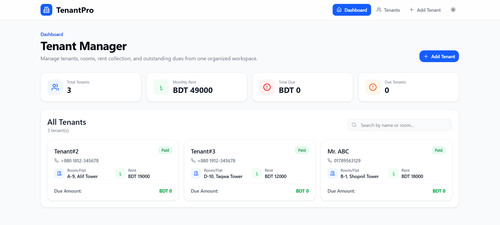
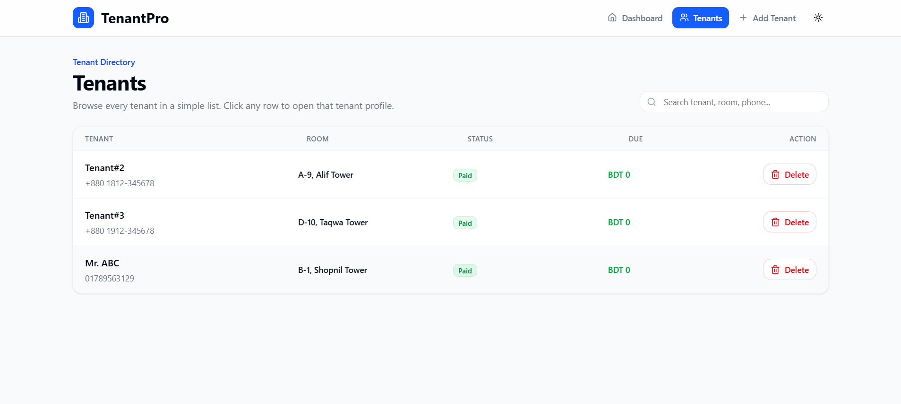
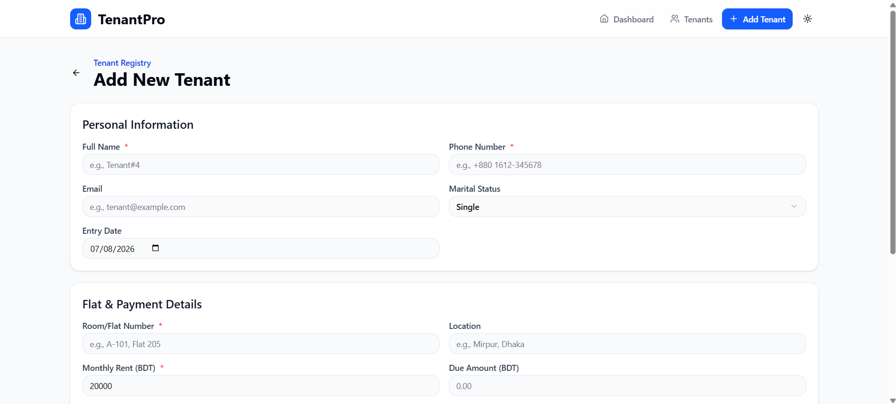

# Tenant Management System

Tenant Management System is a web-based application for managing tenant records, flat details, rent amounts, and payment status in one place.
It was made to help property owners and building managers organize tenant information more easily.
Landlords, property managers, and small rental businesses can use this system to track tenants and view their details quickly.

Live Site: https://monowar-tenent.vercel.app/

## Features

- Tenant dashboard with summary statistics
- Tenant list and directory view
- Add, edit, and delete tenant records
- Tenant profile details
- Flat and payment details management
- Rent and due amount tracking
- Payment status tracking
- Search tenants by name, room, or phone number
- Dark and light mode toggle
- Responsive desktop and mobile layout

## Technologies Used

- React
- TypeScript
- Vite
- Tailwind CSS
- React Router
- Radix UI
- Lucide React
- Sonner
- HTML
- CSS
- JavaScript
- npm

## Screenshots

### Dashboard


### Tenants Page


### Add Tenant Page


## Installation

1. Clone the repository

```bash
git clone https://github.com/username/tenant-management-system.git
```

2. Go to the project folder

```bash
cd tenant-management-system
```

3. Install dependencies

```bash
npm install
```

4. Run the project locally

```bash
npm run dev
```

5. Open the local development URL in your browser

```text
http://localhost:5173/
```

## Folder Structure

- `src/` - Main application source code
- `src/app/` - Application routes, pages, context, and components
- `src/app/pages/` - Page-level UI such as dashboard, tenants, add tenant, edit tenant, and tenant details
- `src/app/components/` - Reusable UI and layout components
- `src/app/contexts/` - Tenant data state management
- `src/styles/` - Global styles, Tailwind setup, fonts, and theme variables
- `guidelines/` - Project guideline documentation
- `public/` - Public static assets, if added later
- `dist/` - Production build output generated after running `npm run build`

## Usage

1. Open the live site or run the project locally.
2. View tenant summary statistics on the dashboard.
3. Go to the Tenants page to see all tenant records.
4. Click any tenant row to view full tenant details.
5. Use Add Tenant to create a new tenant record.
6. Edit tenant information from the tenant details page.
7. Delete tenant records from the Tenants page or tenant details page.
8. Use the search bar to find tenants by name, room, or phone number.
9. Toggle between dark and light mode from the top bar.

## API Endpoints

This project is currently a frontend-only application and does not use backend API endpoints.
Tenant data is managed inside the React application state.

| Method | Endpoint | Description |
|---|---|---|
| N/A | N/A | No API endpoints are available in the current version |

## Environment Variables

This project does not require environment variables to run locally.

If environment variables are added later, create a `.env` file in the project root and add values using Vite's `VITE_` prefix.

Example:

```env
VITE_APP_NAME=TenantManagementSystem
```

## Project Status

This project is currently a prototype and is still being developed.
More features, backend integration, database support, and production improvements may be added in future versions.

## Future Improvements

- Backend API integration
- Database support for persistent tenant records
- User authentication system
- Role-based access for owner, manager, and staff
- Online rent payment tracking
- Monthly invoice or receipt generation
- Advanced analytics dashboard
- Tenant document upload system
- SMS or email rent reminder notifications
- Mobile app version

## Acknowledgements

- React Documentation
- Vite Documentation
- Tailwind CSS Documentation
- Radix UI Documentation
- Lucide Icons
- Sonner Toast Library
- Figma design reference
